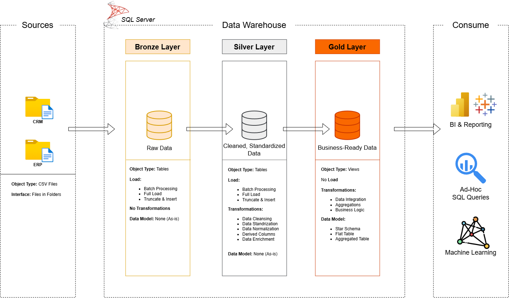

# Modern Data Warehouse & Analytics

This project focuses on building a **modern data warehouse and analytics solution** using **SQL Server**. The goal is to consolidate sales data from two source systems, **ERP and CRM**, into a clean, integrated, and user-friendly data model for analytical reporting and business decision-making.

The project covers the complete data engineering workflow, including **data ingestion, data cleansing, data integration, data modeling, and SQL-based analytics**.

The final data warehouse enables stakeholders and analytics teams to gain meaningful insights into:

* Customer behavior
* Product performance
* Sales trends
* Key business metrics

---

# 🚀 Project Requirements

## Building the Data Warehouse (Data Engineering)

### Objective

Develop a modern data warehouse using SQL Server to consolidate sales data, enabling analytical reporting and informed decision-making.

### Specifications

* **Data Source:** Import data from two source systems (ERP & CRM) provided as CSV files.
* **Data Quality:** Cleanse and resolve data quality issues prior to analysis.
* **Integration:** Combine both sources into a single, user-friendly data model designed for analytical queries.
* **Scope:** Focus on the latest dataset only; historization is not required.
* **Documentation:** Provide clear documentation of the data model to support both business stakeholders and analytics teams.

## BI: Analytics & Reporting (Data Analysis)

### Objective

Develop SQL-based analytics to deliver detailed insights into:

* Customer Behavior
* Product Performance
* Sales Trends

These insights empower stakeholders with key business metrics, enabling strategic decision-making.

For more details, refer to [`docs/requirements.md`](docs/requirements.md).

---

# 🏗️ Data Architecture

The following diagram illustrates the overall data architecture of the modern data warehouse, from source systems to the analytics layer.

### Architecture Overview

The data architecture consists of the following layers:

| Layer | Description |
|---|---|
| **Source Systems** | ERP and CRM systems providing raw sales data in CSV format. |
| **Bronze Layer** | Stores raw data with minimal transformation. |
| **Silver Layer** | Cleans, standardizes, and integrates data from ERP and CRM. |
| **Gold Layer** | Contains business-ready data modeled using a Star Schema. |
| **Analytics** | SQL-based analytics and reporting for business insights. |

The final **Gold Layer** contains:

- `gold.dim_customers`
- `gold.dim_products`
- `gold.fact_sales`

This architecture separates raw data, data transformation, business-ready data, and analytics workloads to make the data warehouse easier to maintain and scale.

---

# 🛡️ License

This project is licensed under the **MIT License**.

See the [`LICENSE`](LICENSE) file for more information.

---

## 👨‍💻 About Me

Hi, I'm **Edly Mulya Andeslin**, a **Data Engineer** passionate about building reliable data pipelines, data warehouses, and data-driven solutions. I am continuously developing my technical skills and gaining hands-on experience in data engineering through practical projects. My goal is to become a **professional Data Engineer** who can design and build scalable, reliable, and efficient data solutions that support meaningful business decisions.

### 🌐 Connect With Me

